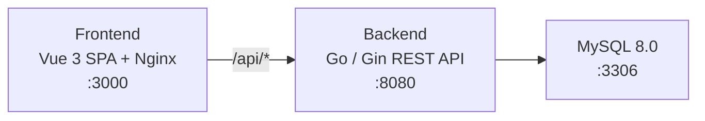

**Project Type:** fullstack

# Multi-Org Data & Media Operations Hub

A full-stack platform for managing multi-organisation data operations, media assets, integrations, and reporting. Built with Vue 3 on the frontend, Go (Gin) on the backend, and MySQL 8 for persistence.

## Architecture Overview



- **Frontend** -- Vue 3 + Vite single-page application served by Nginx. Proxies `/api/*` to the backend.
- **Backend** -- Go REST API using the Gin framework. Handles authentication, RBAC, data operations, media management, scheduling, and integrations.
- **Database** -- MySQL 8.0 with 27 tables covering users, org hierarchy, master data, ingestion pipelines, media, analytics, audit, security, retention, and connectors.

> This project is fully container-contained. Do not install Go, Node.js, or any runtime dependency on the host. Use `docker compose up --build` exclusively.

## Prerequisites

| Tool            | Minimum Version |
|-----------------|-----------------|
| Docker          | 20.10+          |
| Docker Compose  | 2.0+            |

No other tools (Go, Node.js, npm) are required on the host machine.

## Quick Start

```bash
# Clone the repository and start all services
docker compose up --build
```

Docker Compose will:
1. Start MySQL 8.0 and run the init migration automatically (seeds all demo users).
2. Build and start the Go backend (waits for MySQL health check).
3. Build and start the Vue frontend with Nginx reverse proxy.

## Verify the System is Running

### Smoke Check (~30 seconds)

**1. Health endpoint:**

```bash
curl -s http://localhost:8080/health | jq .
```

Expected response (HTTP 200):
```json
{
  "status": "healthy",
  "timestamp": "2025-01-15T12:00:00Z"
}
```

**2. Login as admin:**

```bash
curl -s -X POST http://localhost:8080/api/v1/auth/login \
  -H "Content-Type: application/json" \
  -d '{"username":"admin","password":"Admin@12345678"}' | jq .
```

Expected response (HTTP 200):
```json
{
  "token": "<jwt-access-token>",
  "refreshToken": "<jwt-refresh-token>",
  "user": {
    "id": 1,
    "username": "admin",
    "role": "system_admin",
    "city_scope": "*",
    "department_scope": "*",
    "status": "active"
  }
}
```

**3. UI verification:**

Open http://localhost:3000, log in as `admin` / `Admin@12345678`, confirm the dashboard loads and displays the org tree data in the sidebar.

## Service Endpoints

| Service  | URL                        | Description                 |
|----------|----------------------------|-----------------------------|
| Frontend | http://localhost:3000      | Vue 3 SPA                  |
| Backend  | http://localhost:8080      | Go REST API                |
| MySQL    | localhost:3306             | Database (hub_db)           |

## Default Credentials

All demo users are seeded automatically on `docker compose up`. Password for all accounts: `Admin@12345678`

| Username   | Role                  | City Scope | Department Scope |
|------------|-----------------------|------------|------------------|
| `admin`    | `system_admin`        | `*` (all)  | `*` (all)        |
| `steward`  | `data_steward`        | `NYC`      | `Finance`        |
| `analyst`  | `operations_analyst`  | `NYC`      | `Finance`        |
| `user`     | `standard_user`       | `NYC`      | `Finance`        |

> Change all default passwords immediately after first login in non-development environments.

## Configuration

All backend configuration is passed through environment variables. These are defined in `docker compose.yml` and can be overridden with a `.env` file.

### Database

| Variable      | Default         | Description                          |
|---------------|-----------------|--------------------------------------|
| `DB_HOST`     | `mysql`         | MySQL hostname                       |
| `DB_PORT`     | `3306`          | MySQL port                           |
| `DB_USER`     | `hub_user`      | MySQL username                       |
| `DB_PASSWORD` | `hub_password`  | MySQL password                       |
| `DB_NAME`     | `hub_db`        | MySQL database name                  |

### Authentication & Security

| Variable              | Default                                          | Description                                      |
|-----------------------|--------------------------------------------------|--------------------------------------------------|
| `JWT_SECRET`          | `change-me-in-production-use-strong-secret-here` | HMAC secret for signing JWTs                     |
| `JWT_ISSUER`          | `multi-org-hub`                                  | Issuer claim in JWTs                             |
| `ENABLE_TLS`          | `false`                                          | Enable HTTPS on the backend                      |
| `ENABLE_BIOMETRIC`    | `false`                                          | Enable biometric authentication support          |
| `CORS_ORIGINS`        | `http://localhost:3000`                           | Comma-separated allowed CORS origins             |
| `ALLOWED_HOSTS`       | RFC 1918 ranges + loopback                       | Comma-separated CIDR ranges allowed to connect   |
| `KEY_ROTATION_DAYS`   | `90`                                             | Days between automatic encryption key rotations  |

### Application

| Variable                    | Default            | Description                                               |
|-----------------------------|--------------------|-----------------------------------------------------------|
| `APP_PORT`                  | `8080`             | HTTP listen port                                          |
| `APP_TIMEZONE`              | `America/New_York` | Server timezone for scheduling                            |
| `APP_ENV`                   | `production`       | Environment (`production`, `staging`, `development`)      |
| `LOG_LEVEL`                 | `info`             | Log level (`debug`, `info`, `warn`, `error`)              |
| `RETENTION_PURGE_DAYS`      | `30`               | Frequency in days for retention purge job                 |
| `MISSED_RUN_POLICY`         | `catch-up-once`    | How missed scheduled runs are handled                     |
| `DIR_SYNC_INTERVAL_MINUTES` | `15`               | Interval for directory sync operations                    |

## Running Tests

### Smoke Check (post-startup, ~30 seconds)

After `docker compose up --build`, run the two curl commands from the "Verify the System is Running" section above. Both should return HTTP 200 with the expected JSON shapes.

### Full Test Suite (CI-grade)

The entire test suite runs inside Docker containers with no local toolchain dependency:

```bash
./run_tests.sh
```

This executes:
1. **Backend compile check** -- `go build` inside a Go Alpine container.
2. **Frontend build check** -- `npm run build` inside a Node Alpine container.
3. **Backend tests + coverage** -- `go test` with coverage profiling.
4. **Backend coverage threshold** -- Core-logic function coverage must be >= 90%.
5. **Backend vet check** -- `go vet` for static analysis.
6. **Frontend unit tests + coverage** -- Vitest with v8 coverage.
7. **Frontend coverage threshold** -- Statement coverage must be >= 90%.
8. **Frontend E2E tests** -- Playwright (if configured).

**Interpreting results:** Each step reports `[PASS]` or `[FAIL]`. The script exits with code 0 if all checks pass, or code 1 if any fail. Coverage artifacts are written to `./coverage/`.

### No-Mock Integration Tests (TEST_DB_DSN)

The backend includes true no-mock API tests that exercise the full production router against a real MySQL database. These tests use the `//go:build integration` build tag and are **not included** in a standard test run. To run them via Docker:

```bash
# Run integration tests inside a Docker container with a real test database
docker compose run --rm \
  -e TEST_DB_DSN="hub_user:hub_password@tcp(mysql:3306)/hub_db?charset=utf8mb4&parseTime=True" \
  backend go test -tags integration ./tests/... -v -count=1 -timeout 120s
```

**What happens without TEST_DB_DSN:**
- Without `-tags integration`: integration tests are excluded at build time. Only unit and contract tests run.
- With `-tags integration` but no `TEST_DB_DSN`: tests **fail immediately** with `t.Fatal("TEST_DB_DSN must be set")`. They never silently skip or degrade to mocked behavior.

**What the no-mock tests verify:** Every test authenticates via the real `POST /api/v1/auth/login` endpoint (no `fakeAuthMiddleware` or `signToken` bypasses). The full middleware chain -- CORS, egress guard, JWT auth, RBAC, scope enforcement, handlers, services, database -- is exercised.

The test database is auto-migrated and all tables are cleaned between tests.

## Docker Troubleshooting

### Port conflicts

If `docker compose up` fails with "port already in use":

```bash
# Check which process is using the port
# Linux / macOS
lsof -i :3000  # frontend
lsof -i :8080  # backend
lsof -i :3306  # mysql

# Windows
netstat -ano | findstr :3000
netstat -ano | findstr :8080
netstat -ano | findstr :3306

# Stop the conflicting process, or change ports in docker compose.yml
```

### Stale volumes

If the database has stale data or a corrupted schema from a previous run:

```bash
# Remove all containers AND volumes, then rebuild
docker compose down -v
docker compose up --build
```

### Database boot timing

MySQL may take 10-30 seconds to initialize on first start. The backend container waits for MySQL's health check before starting, but if you hit the API immediately and get connection errors, wait a few seconds and retry:

```bash
# Confirm MySQL is healthy
docker compose ps
# Look for "healthy" in the mysql service status

# Then verify the backend is responding
curl -s http://localhost:8080/health
```

### Container exits immediately

If a container starts and immediately exits:

```bash
# Inspect logs for the failing service
docker compose logs backend
docker compose logs mysql
docker compose logs frontend
```

Common causes: missing environment variables, DB connection refused (MySQL not ready yet), or port conflicts.

## Database Migrations

The initial schema is applied automatically when the MySQL container starts for the first time via Docker entrypoint. The migration file is located at:

```
backend/migrations/init.sql
```

For subsequent migrations:

1. Add new `.sql` files to `backend/migrations/` with a sequential prefix (e.g., `002_add_notifications.sql`).
2. Apply manually or integrate with a migration tool like `golang-migrate` or `goose`.

## Project Structure

```
repo/
+-- docker compose.yml          # Orchestrates all services
+-- run_tests.sh                # Global test runner (Docker-only)
+-- README.md
|
+-- backend/
|   +-- Dockerfile              # Multi-stage Go build
|   +-- go.mod
|   +-- cmd/server/             # Application entry point
|   +-- internal/               # Private application packages
|   +-- tests/                  # API, contract, and unit tests
|   +-- migrations/
|       +-- init.sql            # Full database schema + seed data
|
+-- frontend/
|   +-- Dockerfile              # Multi-stage Node build + Nginx
|   +-- nginx.conf              # Nginx reverse proxy config
|   +-- package.json
|   +-- vite.config.js
|   +-- vitest.config.js
|   +-- src/                    # Vue 3 application source
|
+-- coverage/                   # Generated test coverage artifacts
```

## API Overview

All API endpoints are prefixed with `/api/v1/`. Authentication uses JWT bearer tokens.

### Endpoint Groups

| Group                | Prefix                        | Description                                     |
|----------------------|-------------------------------|-------------------------------------------------|
| Auth                 | `/api/v1/auth`                | Login, logout, token refresh                    |
| Org Nodes            | `/api/v1/org`                 | Organisation tree CRUD, hierarchy navigation    |
| Context              | `/api/v1/context`             | Org context switching and current context       |
| Master Records       | `/api/v1/master`              | Master data CRUD, deactivation, history         |
| Versions             | `/api/v1/versions`            | Version drafts, review, activation              |
| Media                | `/api/v1/media`               | Upload, streaming, lyrics, cover art            |
| Ingestion            | `/api/v1/ingestion`           | Import sources, job management, failure review  |
| Analytics            | `/api/v1/analytics`           | KPI definitions, trends, dashboard data         |
| Reports              | `/api/v1/reports`             | Schedule management, run history, downloads     |
| Integrations         | `/api/v1/integrations`        | Endpoint CRUD, delivery log, connectors         |
| Audit                | `/api/v1/audit`               | Audit log queries, dual-approval deletion       |
| Security             | `/api/v1/security`            | Sensitive fields, key ring, retention, purge    |
| Health               | `/health`                     | Liveness check (no auth required)               |

## Security Features

- **JWT Authentication** -- Stateless token-based auth with configurable expiry and refresh tokens.
- **Role-Based Access Control (RBAC)** -- Four-tier role system (system_admin, data_steward, operations_analyst, standard_user) with city/department scope enforcement.
- **Field-Level Encryption** -- Sensitive fields tracked in a registry with configurable masking strategies; encryption keys managed via the key ring with automatic rotation.
- **Immutable Audit Trail** -- All significant actions logged with old/new value diffs; deletion requires formal dual-approval.
- **Data Retention Policies** -- Configurable per-entity retention with legal hold support to suspend purges.
- **Network Restrictions** -- Configurable allowed host CIDR ranges via egress guard middleware.
- **Password Security** -- Argon2id hashing, reset token expiry, account lockout after failed attempts.
- **Input Validation** -- Request validation and sanitisation at the API layer.
- **Security Headers** -- X-Frame-Options, X-Content-Type-Options, XSS protection, and referrer policy enforced by Nginx.
